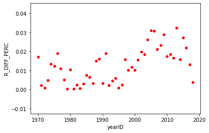
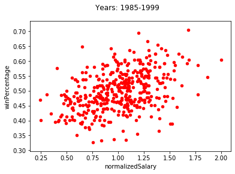
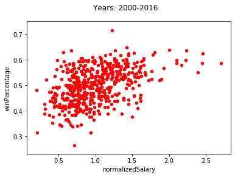
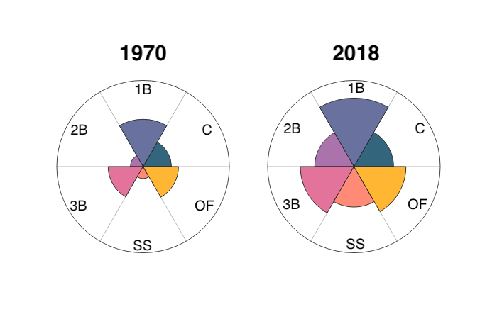
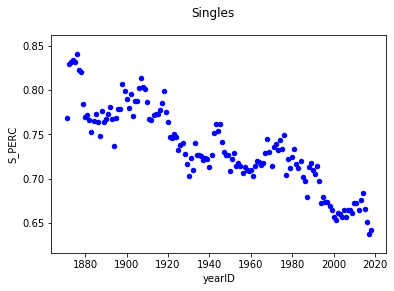
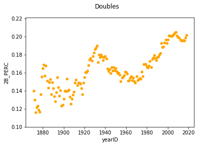
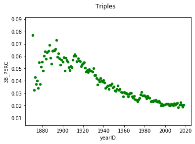
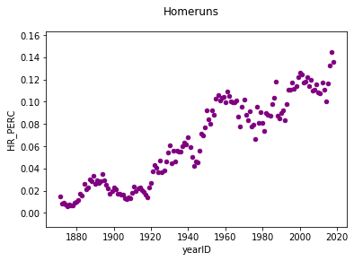
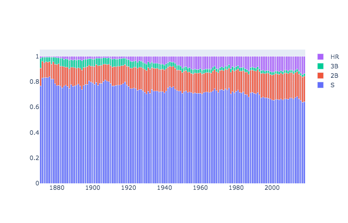

# lahman
Analysis on Lahman's baseball data found here http://www.seanlahman.com/baseball-archive/statistics/

## General Thoughts

#### Why does OBP*TB seem to predict runs less accurately in recent years?

#### Does increasing salary past a certain point guarantee wins?

#### What does the flattening of homerun distribution across positions affect?

#### What is the impact of increase in doubles and homeruns?

